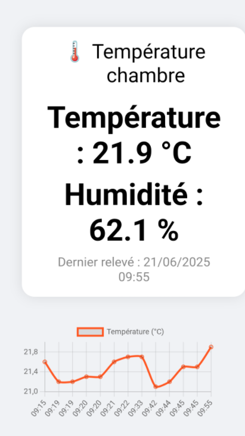

# Pi Zero Temperature Server

A minimal Flask server that reads data from a DHT22 sensor and displays it on a responsive web page with a dynamic Chart.js graph.




## Features

- Reads temperature & humidity from a DHT22 sensor
- Mobile-friendly web interface
- Automatic CSV logging of historical data
- Dynamic graph using Chart.js
- Basic HTTP authentication
- Automatic startup with systemd

## Installation

```bash
git clone https://github.com/cobaye49/pi-zero-temp-server.git
```

```bash
cd pi-zero-temp-server
python3 -m venv env_temp
source env_temp/bin/activate
pip install -r requirements.txt
```

## Launching the server

```bash
python server_temp.py
```

## Autostart with systemd

Copy `temp-web.service` to `/etc/systemd/system/` 

```bash
sudo mv /home/pi/temp-web.service /etc/systemd/system/temp.service
```

then :

```bash
sudo systemctl daemon-reload
sudo systemctl enable temp-web.service
sudo systemctl start temp-web.service
```

## Result

Check the result at : `http://"PI_ZERO_IP":5000/` 

The default user is `pi`  and password is `password` 

